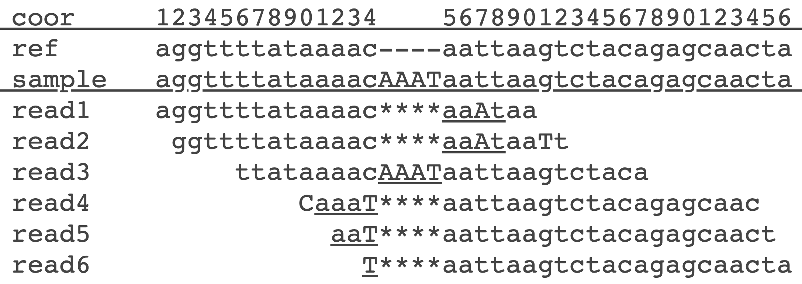

Crash variant calling
=====================

Download Fastq files (same data used in nu-ngs01/Day-2/FASTQC_tutorial.md)
```
mkdir -p ~/workdir/fqData && cd ~/workdir/fqData
wget https://de.cyverse.org/dl/d/3CE425D7-ECDE-46B8-AB7F-FAF07048AD42/samples.tar.gz
tar xvzf samples.tar.gz
```


Download reference file (same reference we used in alignment in nu-ngs01/Day-3/seq_alignment.md)
```
cd ~/workdir/sample_data
wget https://de.cyverse.org/dl/d/A9330898-FC54-42A5-B205-B1B2DC0E91AE/dog_chr5.fa.gz
gunzip dog_chr5.fa.gz
```


BWA Alignment 
=============

We are re-running the code from "nu-ngs01/Day-3/seq_alignment.md"

## install [bwa](http://bio-bwa.sourceforge.net/bwa.shtml)
```
conda activate ngs1
conda install -c bioconda bwa 
```

## index your genome

```
mkdir -p ~/workdir/bwa_align/bwaIndex && cd ~/workdir/bwa_align/bwaIndex
ln -s ~/workdir/sample_data/dog_chr5.fa .
bwa index -a bwtsw dog_chr5.fa
```

## sequence alignment

```
cd ~/workdir/bwa_align
R1="$HOME/workdir/fqData/BD143_TGACCA_L005_R1_001.pe.fq.gz"
R2="$HOME/workdir/fqData/BD143_TGACCA_L005_R2_001.pe.fq.gz"
/usr/bin/time -v bwa mem bwaIndex/dog_chr5.fa $R1 $R2 > BD143_TGACCA_L005.sam
```


Visualize mapping
=================

## install [samtools](http://www.htslib.org/doc/samtools.html)
```
conda activate ngs1
conda install samtools
```

## Index your alignment file
```
# Convert the SAM file into a BAM file that can be sorted and indexed:
samtools view -hbo BD143_TGACCA_L005.bam BD143_TGACCA_L005.sam

# Sort the BAM file by position in genome:
samtools sort BD143_TGACCA_L005.bam -o BD143_TGACCA_L005.sorted.bam

# Index the BAM file so that we can randomly access it quickly:
samtools index BD143_TGACCA_L005.sorted.bam
```

## Visualize mapping using [tview](http://samtools.sourceforge.net/tview.shtml) in samtools
```
samtools tview -p chr5:62155107 BD143_TGACCA_L005.sorted.bam bwaIndex/dog_chr5.fa
```
- Read legand: Understanding [Pileup format](https://en.wikipedia.org/wiki/Pileup_format) should help explaining the symbols in tview
    * . (dot) means a base that matched the reference on the forward strand
    * , (comma) means a base that matched the reference on the reverse strand
    * AGTCN (upper case) denotes a base that did not match the reference on the forward strand
    * agtcn (lower case) denotes a base that did not match the reference on the reverse strand
    *  \* (asterisk) is a placeholder for a deleted base (e.g. -p chr5:62153561 & -p chr5:62172431 & -p chr5:62174911)
- Consensus sequence:
    * On the third line from the top
    * It does not require a reference sequence! (try -p chr5:62170721 with and without reference)
    * identify regions with variation and mark these accordingly (e.g. with the appropriate [nucleic acid notation](https://en.wikipedia.org/wiki/Nucleic_acid_notation) such as Y, K, R, etc.) e.g  -p chr5:62169161  and -p chr5:62176581
- In the viewer: 
    * press `?` for help
    * `q` to quit
    * CTRL-H and CTRL-L do “big” scrolls
    * g chr5:62167341 will take you to a specific location. 
    * try (m vs n or b) 
    * At -p chr5:62172431 ==> try C vs N then try i 


## Visualize mapping using [IGV](https://bioinformatics-ca.github.io/resources/IGV_Tutorial.pdf)

```
cd ~
wget https://data.broadinstitute.org/igv/projects/downloads/2.8/IGV_Linux_2.8.13_WithJava.zip
unzip IGV_Linux_2.8.13_WithJava.zip
sudo echo 'export IGV=$HOME/IGV_Linux_2.8.13/igv.sh' >> ~/.bashrc
source ~/.bashrc
conda activate ngs1
cd ~/workdir/bwa_align
bash $IGV -g bwaIndex/dog_chr5.fa BD143_TGACCA_L005.sorted.bam
```

Variant calling by [BCFTools](http://samtools.github.io/bcftools/)
==================================================================
This is a two-step process:  

1. mpileup: 
- Generate **genotype likelihoods** for one or multiple alignment files. 
- Individuals are identified from the SM tags in the @RG header lines. Thus multiple individuals can be pooled in one alignment file, also one individual can be separated into multiple files. If sample identifiers are absent, each input file is regarded as one sample.
- The calculation takes into account mapping qualities of the reads, base qualities, and per-base alignment quality (BAQ)
- **Base alignment quality (BAQ)** is the Phred-scaled probability of a read base being misaligned. Applying this option greatly helps to reduce false SNPs caused by misalignments (See below). It is calculated by default but you can turn off this computationally intensive procedure by using `--no-BAQ` option. 
- `-Ou` option for piping between bcftools subcommands to speed up performance by removing unnecessary compression/decompression and VCF←→BCF conversion.

2. Call: 
- SNP/indel calling 
- It considers 
    * the ploidy status (`--ploidy ASSEMBLY`), 
    * prior knowledge of population allele frequencies (`--prior-freqs AN,AC`), 
    * population structure (`--group-samples`), 
    * Inheritance (`--constrain`), 
    * variant-calling models: the [original biallelic caller](https://pubmed.ncbi.nlm.nih.gov/21903627/) (`-c`) and a newer model capable of handling positions with multiple alternate alleles (`-m`) and supporting [gVCF output](https://sites.google.com/site/gvcftools). 
    * expected substitution rate (`--prior float` default=1.1e-3, make bigger for more sensitive call, smaller for more restrictive call, and 0 to disable the prior) 
- `-v` output variant sites only

## Install [BCFTools](http://www.htslib.org/doc/bcftools.html)
```
conda install bcftools
bcftools mpileup -Ou -f bwaIndex/dog_chr5.fa BD143_TGACCA_L005.sorted.bam |\
bcftools call -Ov -mv > BD143_TGACCA_L005.vcf
```


**False SNPs caused by nearby INDELs**

Example from the page of [Calling SNPs/INDELs with SAMtools/BCFtools](http://samtools.sourceforge.net/mpileup.shtml): The following image shows the alignments of 6 reads by a typical read mapper in the presence of a 4bp homozygous INDEL. Capital bases represent differences from the reference and underlined bases are the inserted bases. All alignments except for read3 are wrong because the 4bp insertion is misplaced. The mapper produces such alignments because when doing a pairwise alignment, the mapper prefers one or two mismatches over a 4bp insertion. **Wrong alignments lead to recurrent mismatches.**


   
   
   
 How to avoid this problem?
 
 1. multi-sequence realignment but computationally demanding
 2. SAMtools: It assigns each base a BAQ which is the Phred-scaled probability of the base being misaligned. BAQ is low if the base is aligned to a different reference base in a suboptimal alignment, and in this case a mismatch should contribute little to SNP calling even if the base quality is high. 
 3. GATK: local assembly


**Benchmarking** https://www.ncbi.nlm.nih.gov/pmc/articles/PMC7238416/
