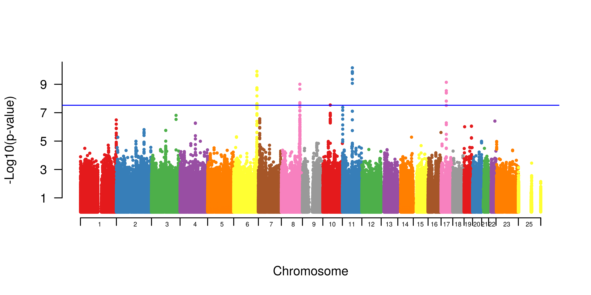

# Meta-Analysis of Genome Wide Association Studies

**Meta-analysis of multiple genome-wide association studies has several advantages**: 
1.  increases the power for detecting variants with modest effect sizes  
2.  reduces the study specific false positives.  
3.  Meta-analysis in contrast to direct analysis of pooled individual-level data: 
    1.  alleviates common concerns with privacy of study participants  
    2.  avoids cumbersome integration of genotype and phenotypic data from different studies. 
    3.  allows for custom analyses of individual studies to conveniently account for population substructure, the presence of related individuals, study-specific covariates and many other ascertainment-related issues.


**Methods of Meta-analysis implemented in [METAL](http://genome.sph.umich.edu/wiki/METAL_Documentation)**: The basic principle of meta-analysis is to combine the evidence for association from individual studies, using appropriate weights. METAL can combine either 
1.  weights the effect size estimates, or β-coefficients, by their estimated standard errors - Thie requires effect size estimates and their standard errors to be in consistent units across studies
2.  p-values across studies (taking sample size and direction of effect into account). In a study with unequal numbers of cases and controls, Metal recommends that the [effective sample size](https://en.wikipedia.org/wiki/Effective_sample_size) be provided in the input file, where Neff = 4/(1/Ncases+1/Nctrls). 

Today we will conduct a *meta-analysis* of two previously conducted prostate cancer GWASs in humans.

## Download METAL

```
cd
curl -O http://csg.sph.umich.edu/abecasis/Metal/download/Linux-metal.tar.gz
tar -xvzf Linux-metal.tar.gz 
sudo mv generic-metal/metal /usr/local/bin/.
```

### Download a prostate cancer dataset and unpack

```
wget https://de.cyverse.org/dl/d/9DEF6A65-F0A7-4C6E-8633-957C118FD1B3/meta_GWAS.tar.gz
tar -xvzf meta_GWAS.tar.gz
cd ~/meta_GWAS
```

Let's look at each study's manhattan plot.

** Study1:prostate-606 **


** Study2:prostate-396 **




We may be able to use the power of meta-analysis to resolve some of the questionably significant markers.

Let's use METAL to run a meta-analysis of the effect size weighted by estimated standard errors for each study.


### Run metal

Start METAL:
```
metal
``` 
and press `enter` to access the program.

Next, lets tell METAL what files to read in and a little bit about the files:

```
# METAL commands
# READ in 606 data
SCHEME STDERR
MARKER SNP_ID
ALLELE Allele.1 Allele.2
EFFECT beta
STDERR SE
PROCESS prostate_606.assoc.logistic

# READ in 733 data
MARKER SNP
ALLELE A1 A2
EFFECT BETA
STDERR SE
PROCESS prostate_396.assoc.logistic

ANALYZE
```

Now exit the program by typing 
```
quit
```
and hitting the `return` key.

We can see our meta-analysis results in the `METAANALYSIS1.TBL` file.


## Visualize Meta-Analysis Results
First, we need to install one more R package **RColorBrewer**.

```
sudo Rscript -e "install.packages('RColorBrewer', contriburl=contrib.url('http://cran.r-project.org/'))"
```

Now we can create a manhattan plot from our results. 

```
Rscript create_manhattan.R METAANALYSIS1.TBL
``` 

This will take a minute.

Now lets view our plot in the RStudio server tab!

```
setwd("/home/tx160085/meta_GWAS")
openPDF("METAANALYSIS1.TBL.allChrs.manhattan.png")
```

### More readings 
[http://www.nature.com/nrg/journal/v14/n6/full/nrg3472.html](http://www.nature.com/nrg/journal/v14/n6/full/nrg3472.html)
